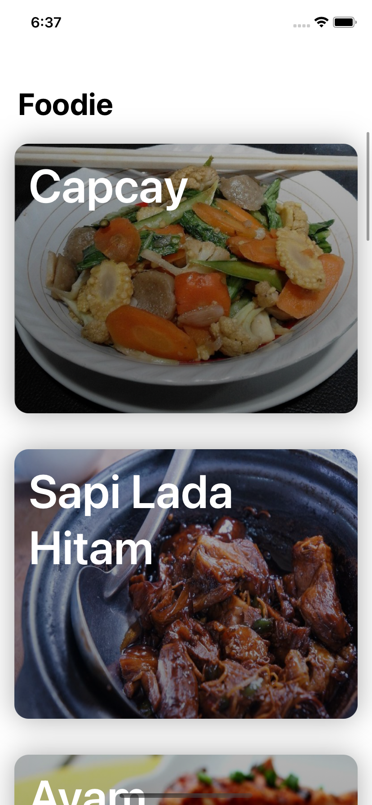
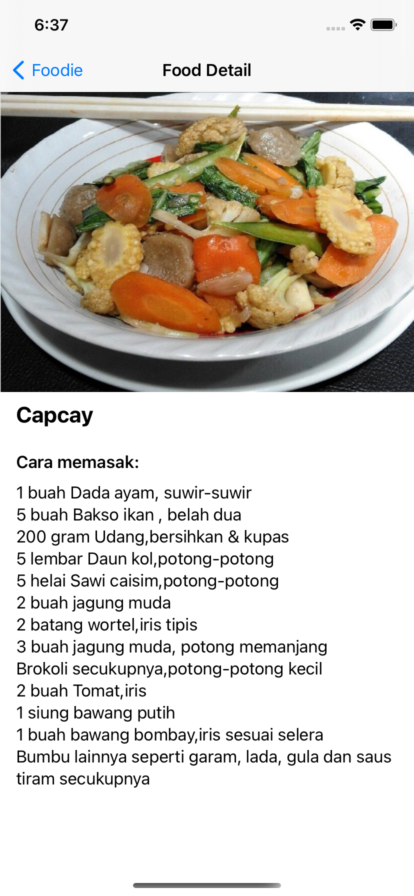

# Foodie App

## Screenshots

<p float="left">


</p>

## Getting Started

These instructions will get you a copy of the project up and running on your local machine for development and testing purposes. See deployment for notes on how to deploy the project on a live system.

### Prerequisites

* Xcode 12.4 or latest

### Installing

```
1. Clone or download this project
2. Open the project using Xcode
3. Run using an iOS simulator or real device
```

## Built With

* SwiftUI
* SDWebImageSwiftUI
* Alamofire

## Author

Prima Santosa - mauliawan@primasantosa.com
